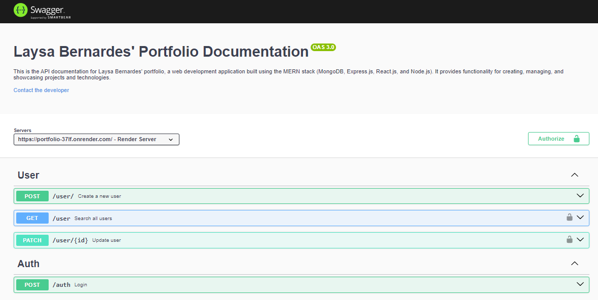

# Portfolio Back-End
Este repositório contém o código do back-end do meu portfólio, desenvolvido com Node.js, Express, e MongoDB. O objetivo do projeto é permitir a gestão dinâmica do conteúdo do portfólio, como projetos, tecnologias e seções, de forma segura e eficiente.

## 🔍 Visão Geral
O back-end foi projetado para fornecer uma API RESTful que permite:
- **Gerenciamento de Usuário**: Criação, autenticação e segurança para acessar a plataforma.
- **CRUD de Projetos**: Adicionar, atualizar, visualizar e deletar projetos diretamente pelo painel, sem necessidade de alterar o código.
- **CRUD de Tecnologias**: Gerenciamento das tecnologias associadas aos projetos.
- **Gerenciamento de Seções do Portfólio**: Atualização de seções de conteúdo do portfólio de forma flexível.

## 🛠️ Tecnologias Utilizadas
- **Node.js**: Ambiente de execução JavaScript.
- **Express**: Framework para construção de APIs com Node.js.
- **MongoDB**: Banco de dados NoSQL utilizado para armazenamento de dados.
- **Mongoose**: Biblioteca ODM (Object Data Modeling) para MongoDB e Node.js.
- **JWT (JSON Web Tokens)**: Para autenticação e segurança.
- **Bcrypt**: Para criptografia de senhas.
- **Dotenv**: Para gerenciamento de variáveis de ambiente.
- **Swagger**: Para a documentação e testes da API.

## 📚 Documentação da API e Deploy 

A documentação da API foi criada utilizando **Swagger** e está disponível no deploy para facilitar o uso e a integração com o sistema. Para acessar a documentação e testar as rotas diretamente, utilize o seguinte link:
[Documentação Swagger](https://portfolio-37lf.onrender.com/doc/)

[Deploy do Back-End](https://portfolio-37lf.onrender.com)

## 📊 Modelagem de Dados
Abaixo está a modelagem das informações utilizadas no back-end:

